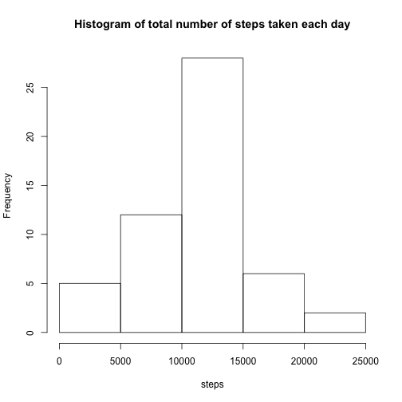
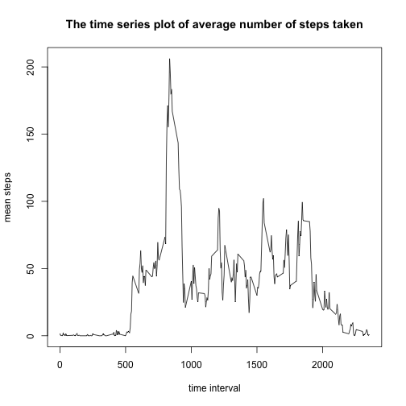
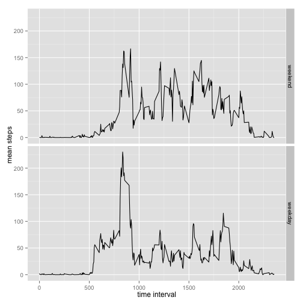

Loading the data


```r
activity <- read.csv(file = "activity.csv")
```
Q1: What is mean total number of steps taken per day?
=====================================================
Format the dataset as per day

```r
library(reshape2)
activity_perday <- melt(activity, id = "date")
activity_perday <- dcast(activity_perday, date~variable, sum)
```

Make histogram of the total number of steps taken each day


```r
hist(activity_perday$steps, main="Histogram of total number of steps taken each day", xlab = "steps", breaks = 5)
```

 

Calculate the mean and median of the total number of steps taken per day


```r
mean(activity_perday$steps, na.rm = TRUE)
```

```
## [1] 10766.19
```

```r
median(activity_perday$steps, na.rm = TRUE)
```

```
## [1] 10765
```

Q2: What is the average daily activity pattern?
===============================================
Make the time series plot
First, format the dataset by group steps by interval. Then make a plot.


```r
library(dplyr)
byinterval <- group_by(activity, interval)
q2plotdata <- summarise(byinterval, stepmean = mean(steps, na.rm = T))
with(q2plotdata, {plot(interval, stepmean, type = 'l', xlab = "time interval", ylab="mean steps", main="The time series plot of average number of steps taken")})
```

 

Find out which time interval contains the maximum number of steps.

```r
q2plotdata[which.max(q2plotdata$stepmean),]
```

```
## Source: local data frame [1 x 2]
## 
##   interval stepmean
##      (int)    (dbl)
## 1      835 206.1698
```

Q3 Imputing missing values
==========================
Calculate and report the total number of missing values in the dataset


```r
sapply(activity, function(x) sum(is.na(x)))
```

```
##    steps     date interval 
##     2304        0        0
```

Fill the missing value with the mean of that 5-minite interval.

```r
activity$steps2 <- activity$steps
naplace <- which(is.na(activity$steps))
for(i in naplace){
  j <- i%%288
  if(j != 0) {
    activity$steps2[i] <- q2plotdata$stepmean[j]
  } else{
    activity$steps2[i] <- q2plotdata$stepmean[288]
  }  
}
```

Create a new dataset that is equal to the original dataset with non missing value.


```r
activity2 <- activity[, 2:4]
sapply(activity2, function(x) sum(is.na(x)))
```

```
##     date interval   steps2 
##        0        0        0
```

```r
summary(activity2)
```

```
##          date          interval          steps2      
##  2012-10-01:  288   Min.   :   0.0   Min.   :  0.00  
##  2012-10-02:  288   1st Qu.: 588.8   1st Qu.:  0.00  
##  2012-10-03:  288   Median :1177.5   Median :  0.00  
##  2012-10-04:  288   Mean   :1177.5   Mean   : 37.38  
##  2012-10-05:  288   3rd Qu.:1766.2   3rd Qu.: 27.00  
##  2012-10-06:  288   Max.   :2355.0   Max.   :806.00  
##  (Other)   :15840
```

Plot the total number of steps taken each day, and caculate mean and median from the new dataset.


```r
activity2perday <- melt(activity2, id = "date")
activity2perday <- dcast(activity2perday, date~variable, sum)
hist(activity2perday$steps, main="Histogram of total number of steps taken each day with missing value filled", xlab = "steps", breaks = 5)
```

 

```r
mean(activity2perday$steps, na.rm = TRUE)
```

```
## [1] 10766.19
```

```r
median(activity2perday$steps, na.rm = TRUE)
```

```
## [1] 10766.19
```

Q4 Are there differences in activity patterns between weekdays and weekends?
============================================================================
Translate the date as a factor


```r
activity2$day <- weekdays(as.Date(activity2$date))
weekend <- c("Saturday", "Sunday")
activity2$week <- factor((activity2$day %in% weekend), levels = c(TRUE, FALSE), labels=c('weekend','weekday'))
byinterval2 <- group_by(activity2, interval, week)
q4plotdata <- summarise(byinterval2, stepmean = mean(steps2))
```

Make plot to show difference between weekday and weekend

```r
library(ggplot2)
qplot(interval, stepmean, data= q4plotdata, geom="line", xlab="time interval", ylab = "mean steps", facets = week~.)
```

 


